# Claude Code 源码深度分析

> 基于 Claude Code v2.1.88 源码（从 NPM 包 source map 还原）的全面架构分析。

---

## 目录

- [第一部分：项目总览](#第一部分项目总览)
- [第二部分：核心架构分析](#第二部分核心架构分析)
- [第三部分：关键设计深挖](#第三部分关键设计深挖)
- [第四部分：代码质量与工程实践](#第四部分代码质量与工程实践)
- [第五部分：可借鉴的设计](#第五部分可借鉴的设计)

---

## 第一部分：项目总览

### 1. 项目结构

```
claude-code-source/
├── build.ts                         # Bun 构建脚本（含 90+ feature flags）
├── package.json                     # 项目配置（ESM, version 2.1.88）
├── tsconfig.json                    # TypeScript 配置
├── pnpm-lock.yaml                   # pnpm 依赖锁
├── pnpm-workspace.yaml              # Monorepo 工作区
├── patches/                         # pnpm 依赖补丁
├── stubs/                           # 私有依赖存根
│   ├── @anthropic-ai/mcpb/          # MCP bundle processor
│   ├── @anthropic-ai/sandbox-runtime/ # 沙箱运行时
│   ├── @ant/claude-for-chrome-mcp/  # Chrome 扩展 MCP
│   ├── color-diff-napi/             # 语法高亮原生模块
│   └── modifiers-napi/              # macOS 按键修饰符
├── vendor/                          # 内部原生模块源码
│   ├── audio-capture-src/           # 音频输入
│   ├── image-processor-src/         # 图像处理
│   ├── modifiers-napi-src/          # macOS 按键
│   └── url-handler-src/             # URL 处理
└── src/                             # ★ 核心源码（1900+ 文件）
    ├── entrypoints/                 # 入口点（cli.tsx 等）
    ├── bootstrap/                   # 启动与初始化
    ├── main.tsx                     # 主 REPL 逻辑
    ├── Tool.ts                      # 工具类型系统
    ├── tools.ts                     # 工具注册
    ├── tools/                       # ★ 工具实现（184 文件）
    ├── commands.ts                  # 命令注册
    ├── commands/                    # ★ 斜杠命令（207+ 文件）
    ├── Task.ts / tasks.ts           # 后台任务系统
    ├── tasks/                       # 任务实现
    ├── QueryEngine.ts               # SDK 查询引擎
    ├── query.ts                     # ★ 核心 Agent Loop
    ├── services/                    # ★ 核心服务（130 文件）
    │   ├── api/                     # Anthropic API 调用
    │   ├── compact/                 # 上下文压缩
    │   ├── mcp/                     # MCP 协议集成
    │   ├── tools/                   # 工具编排/执行
    │   └── tokenEstimation.ts       # Token 估算
    ├── components/                  # ★ Ink 终端 UI（389 文件）
    ├── screens/                     # 屏幕视图
    ├── hooks/                       # ★ 生命周期 Hook（104 文件）
    ├── context/                     # 上下文管理
    ├── state/                       # 状态管理
    ├── skills/                      # 技能系统
    ├── plugins/                     # 插件系统
    ├── memdir/                      # 记忆文件系统
    ├── utils/                       # ★ 工具函数（564 文件）
    │   ├── settings/                # 配置加载
    │   ├── permissions/             # 权限系统
    │   ├── hooks/                   # Hook 执行引擎
    │   ├── bash/                    # Shell 工具
    │   ├── git/                     # Git 操作
    │   ├── telemetry/               # 遥测
    │   └── ...
    ├── cli/                         # CLI 参数解析
    ├── bridge/                      # IDE/远程桥接（31 文件）
    ├── remote/                      # 远程执行
    ├── coordinator/                 # 多 Agent 协调
    ├── buddy/                       # Sub-agent 系统
    ├── constants/                   # 共享常量
    ├── types/                       # TypeScript 类型
    ├── schemas/                     # 数据 Schema
    ├── migrations/                  # 数据迁移
    ├── ink/                         # 自定义 Ink 引擎
    ├── keybindings/                 # 快捷键
    ├── vim/                         # Vim 模式
    └── voice/                       # 语音输入
```

**项目统计：**

| 指标 | 数量 |
|------|------|
| 核心源码文件 | 1,900+ |
| src/ 子目录 | 36 |
| 工具实现 | 184 文件 |
| 斜杠命令 | 207+ 文件 |
| UI 组件 | 389 文件 |
| 工具函数 | 564 文件 |
| 编译时 Feature Flags | 90+ |

### 2. 技术栈

| 类别 | 技术 | 说明 |
|------|------|------|
| **语言** | TypeScript 6.0.2 + TSX | 非 strict 模式，React JSX |
| **运行时** | Node.js 18+ | 生产环境 |
| **构建工具** | Bun 1.3.11 | 编译时 feature flag 注入 |
| **包管理** | pnpm | Monorepo workspace |
| **UI 框架** | React 19.2.4 + Ink 6.8.0 | 终端 React 渲染器 |
| **CLI 解析** | Commander 14.0.3 | 已打补丁支持多字符短选项 |
| **Schema 校验** | Zod 4.3.6 | 运行时类型校验 |
| **API 客户端** | @anthropic-ai/sdk 0.80.0 | Anthropic API |
| **MCP 协议** | @modelcontextprotocol/sdk 1.29.0 | Model Context Protocol |
| **进程管理** | Execa 9.6.1 | 子进程执行 |
| **HTTP** | Axios 1.14.0 | HTTP 客户端 |
| **遥测** | OpenTelemetry | 分布式追踪 |
| **云集成** | AWS SDK / Azure Identity / Google Auth | 多云认证 |

### 3. 入口点与启动流程

**入口文件：** `src/entrypoints/cli.tsx:33` → 编译为 `dist/cli.js`

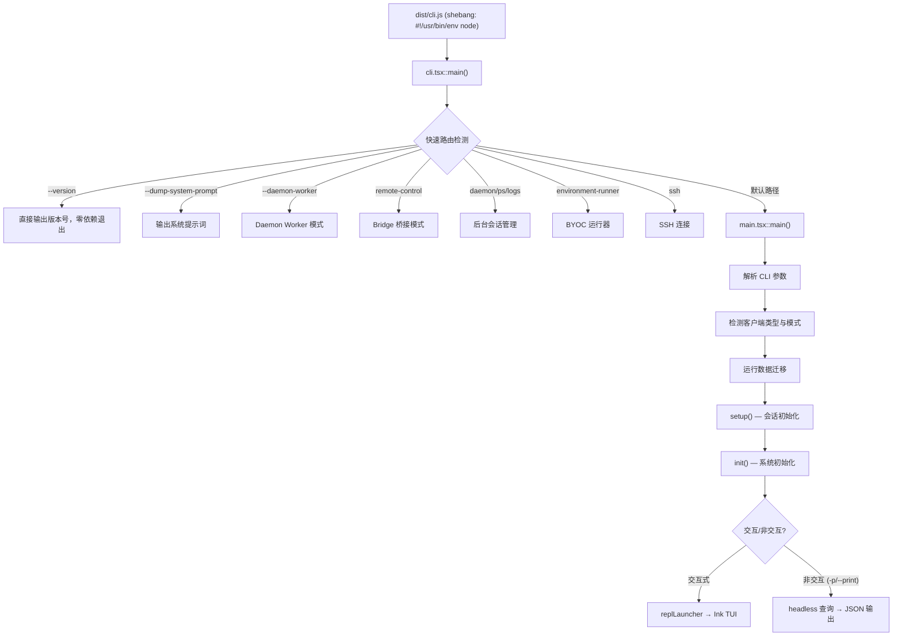

**启动链路关键文件：**

| 阶段 | 文件 | 行号 | 职责 |
|------|------|------|------|
| 入口 | `src/entrypoints/cli.tsx` | L33 | 快速路由，最小化导入 |
| 主逻辑 | `src/main.tsx` | L585 | 完整 CLI 初始化 |
| 会话初始化 | `src/setup.ts` | L56 | Node 版本检查、CWD、Hook、Worktree |
| 系统初始化 | `src/entrypoints/init.ts` | L57 | 配置、网络、mTLS、遥测 |
| 全局状态 | `src/bootstrap/state.ts` | - | 模块级全局状态管理 |

**关键设计：快速路由优化**

`cli.tsx` 采用 **fast-path bootstrap** 策略 — 对 `--version`、`--daemon-worker` 等常用标志进行零/最小导入的快速检测，避免加载完整 CLI 框架的开销。只有默认路径才会触发完整的 `main.tsx` 加载。

---

## 第二部分：核心架构分析

### 4. 架构模式

Claude Code 采用**分层 Agent Loop 架构**，结合 CLI 框架、React 终端 UI、插件系统和事件驱动的 Hook 机制。

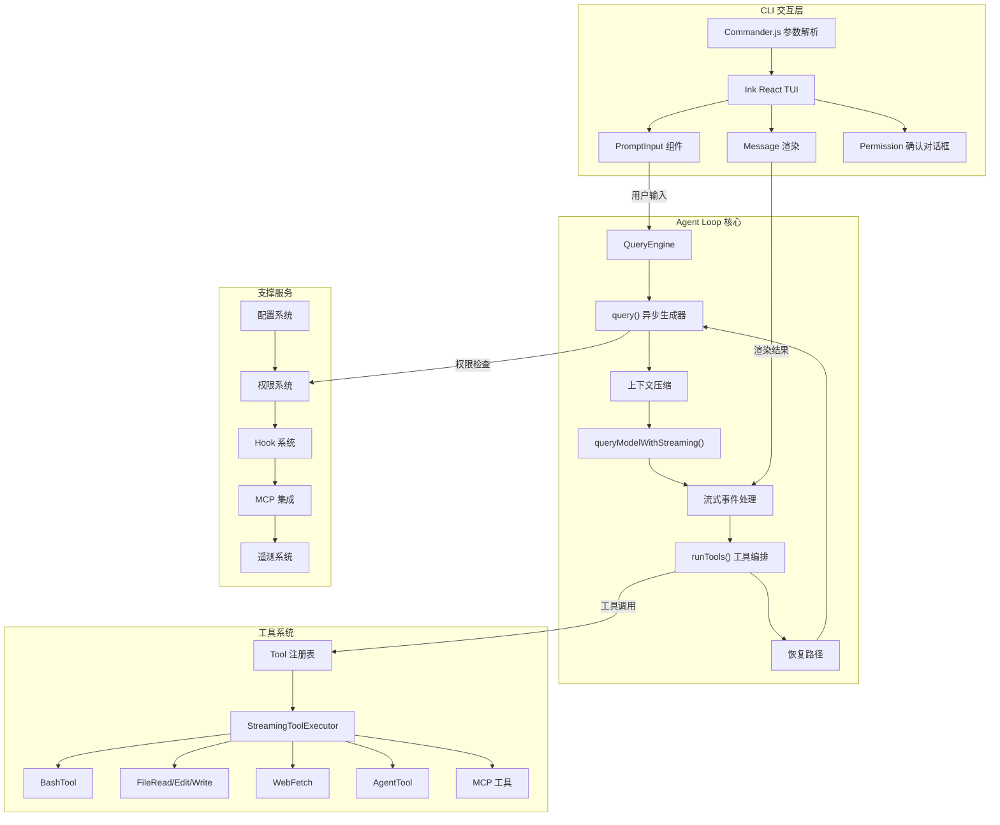

### 5. 核心模块拆解

#### 5.1 CLI 交互层

**职责：** 命令解析、参数处理、终端 UI 渲染。

**关键代码路径：**
- 命令解析：`src/cli/` → Commander.js（已打补丁支持多字符短选项）
- 终端 UI：`src/components/` → Ink React 组件
- 输入处理：`src/components/PromptInput/` → 18 个子组件
- 消息渲染：`src/components/Message.tsx` → 2000+ 行，路由到专用消息组件

**核心逻辑：**

```
用户键入文本 → PromptInput 组件捕获
   → 检测 / 前缀 → 路由到 Command 系统
   → 普通文本 → 提交到 QueryEngine
   → 渲染 AssistantMessage → VirtualMessageList 虚拟列表
   → 权限弹窗 → PermissionDialog 组件
```

**UI 技术栈特点：**
- 使用 **React Context + Hooks** 管理全局状态（无 Redux/Zustand）
- `VirtualMessageList` 实现高效终端消息滚动
- 支持 Vim 模式、语音输入、主题系统
- 多种输入模式：normal、vim、command

#### 5.2 Agent Loop / 对话循环

**职责：** 管理「用户输入 → 模型调用 → 工具执行 → 结果返回」的核心循环。

**三层架构：**

| 层级 | 文件 | 职责 |
|------|------|------|
| Layer 1 | `src/QueryEngine.ts:1` | SDK/Headless 入口，管理会话状态和消息持久化 |
| Layer 2 | `src/query.ts:219` | ★ 核心 Agent Loop，管理对话轮次和恢复路径 |
| Layer 3 | `src/services/api/claude.ts:752` | API 请求，处理流式响应 |

**核心 Agent Loop 流程：**

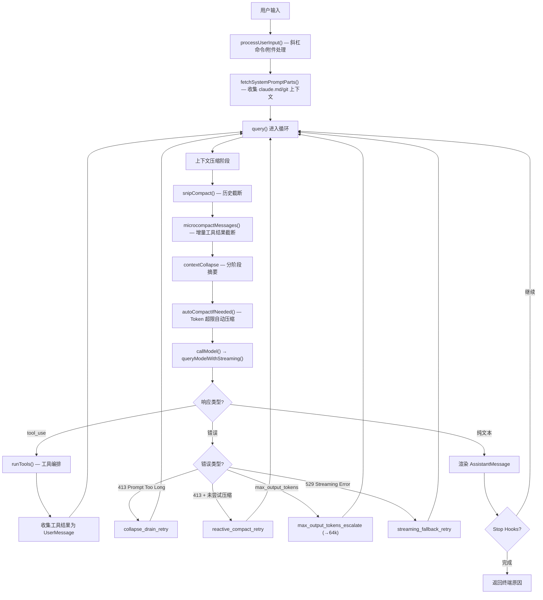

**恢复路径（7 个显式续接点）：**
> 文件 `src/query.ts`

| 恢复路径 | 行号 | 触发条件 | 动作 |
|----------|------|----------|------|
| `collapse_drain_retry` | ~L1065 | 413 + 有待处理的 collapse 队列 | 排空 staging 队列后重试 |
| `reactive_compact_retry` | ~L1164 | 413 + 首次尝试 | 全量摘要后重试 |
| `max_output_tokens_escalate` | ~L1219 | 首次触发输出上限 | 提升到 64k tokens 重试 |
| `max_output_tokens_recovery` | ~L1246 | 输出上限 + 恢复次数 < 3 | 注入"继续"元消息，最多 3 次 |
| `streaming_fallback_retry` | - | 529 流式错误 | 回退到非流式 API |
| `token_budget_continuation` | ~L1338 | Token 预算检查通过 | 发送 nudge 消息继续 |
| `stop_hook_continuation` | ~L1390 | Stop Hook 要求继续 | 带 hook 结果重新进入 |

#### 5.3 工具系统（Tool System）

**职责：** 工具注册、调度、执行、结果处理。

**核心类型定义** — `src/Tool.ts:362`：

```typescript
type Tool<Input, Output, P> = {
  name: string
  inputSchema: ZodSchema<Input>
  
  // 核心方法
  call(input, context, permCheck, progress): Promise<Output>
  description(): string
  prompt(): string
  checkPermissions(input, context): PermissionResult
  validateInput(input): ValidationResult
  
  // 渲染方法
  renderToolUseMessage(): ReactElement
  renderToolResultMessage(): ReactElement
  renderToolUseProgressMessage(): ReactElement
  
  // 分类方法
  isConcurrencySafe(input): boolean    // 并发安全标识
  isReadOnly(): boolean                // 只读操作标识
  isDestructive(): boolean             // 破坏性操作标识
}
```

**工具注册** — `src/tools.ts:193`：

```typescript
// getAllBaseTools() — 返回所有基础工具
function getAllBaseTools(): Tool[] {
  return [
    AgentTool,        // 子 Agent 调用
    BashTool,         // Shell 命令执行
    FileReadTool,     // 文件读取
    FileEditTool,     // 文件编辑
    FileWriteTool,    // 文件写入
    GlobTool,         // 文件搜索
    GrepTool,         // 内容搜索
    WebFetchTool,     // Web 请求
    SkillTool,        // 技能调用
    // ... 60+ 工具（含条件性工具）
  ]
}

// getTools() — 用户可见工具（经过过滤）
function getTools(permissionContext): Tool[] {
  if (CLAUDE_CODE_SIMPLE) return [Bash, Read, Edit]
  return getAllBaseTools()
    .filter(filterToolsByDenyRules)      // 过滤拒绝规则
    .filter(t => !REPL_ONLY_TOOLS(t))   // 排除 REPL 专用工具
    .filter(t => t.isEnabled())          // 只保留启用的工具
}
```

**工具池组装：** `assembleToolPool()` 合并内置工具 + MCP 工具，按名称去重（内置优先），排序以保证 **prompt-cache 稳定性**。

#### 5.4 权限与安全模型

**职责：** 权限控制、沙箱机制、用户确认流程。

**权限模式** — `src/utils/permissions/PermissionMode.ts`：

| 模式 | 说明 |
|------|------|
| `default` | 每次操作询问用户 |
| `plan` | 计划模式（执行前审查） |
| `acceptEdits` | 自动接受文件编辑 |
| `auto` | ML 分类器自动审批 |
| `bypassPermissions` | 跳过所有提示（危险） |

**权限决策流程** — `src/utils/permissions/permissions.ts:473`：

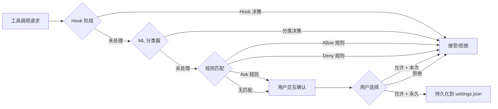

**权限规则语法：**
- `Bash(git *)` — Bash 命令匹配 "git *"
- `Write(/path/*.ts)` — 写入匹配路径的文件
- `Read(*.json)` — 读取匹配的文件

**存储层级：**
1. 用户级：`~/.claude/settings.json` → `permissions.allow/deny/ask`
2. 项目级：`.claude/settings.json`
3. 企业级：`managed-mcp.json`（只读）

#### 5.5 上下文管理

**职责：** 对话历史、Token 管理、上下文窗口策略。

**四层压缩策略：**

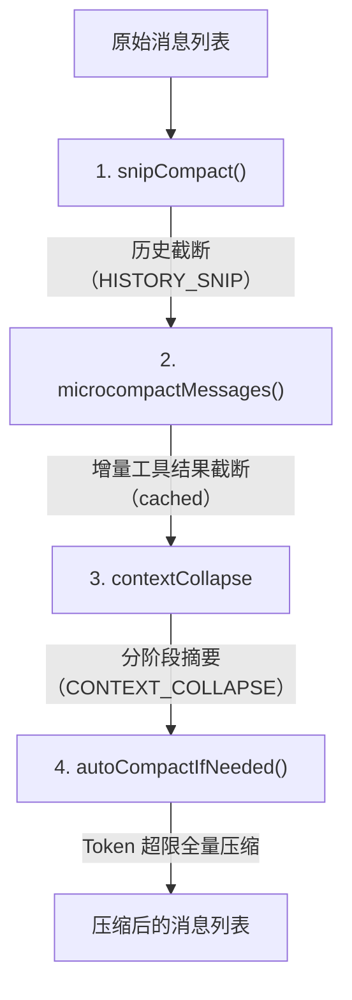

| 压缩策略 | 触发时机 | 方式 |
|----------|----------|------|
| **Snip Compact** | 每轮开始 | 截断旧历史，保留 replay |
| **Micro Compact** | 每轮开始（cached） | 增量截断大型工具结果 |
| **Context Collapse** | Token 接近上限 | 分阶段摘要 + drain-first 恢复 |
| **Auto Compact** | Token 超过预算 | 全量对话摘要 |
| **Reactive Compact** | 413 错误后 | 紧急压缩 + 去除媒体 |

**Token 计数** — `src/utils/tokens.ts`：
```typescript
function tokenCountWithEstimation(messages: Message[]): number {
  // 1. 找到最近 API 响应的 usage（input + output + cache）
  // 2. 处理并行工具调用（回溯到第一个 sibling block）
  // 3. 加上后续消息的粗略估算
  return getTokenCountFromUsage(usage) + roughEstimate(remaining)
}
```

**记忆文件系统** — `src/memdir/`：

加载优先级（后者覆盖前者）：
1. 托管记忆：`/etc/claude-code/CLAUDE.md` — 全局系统指令
2. 用户记忆：`~/.claude/CLAUDE.md` — 用户私有全局指令
3. 项目记忆：`CLAUDE.md`、`.claude/CLAUDE.md`、`.claude/rules/*.md`
4. 本地记忆：`CLAUDE.local.md` — 私有项目指令（gitignored）

支持 `@path` include 指令，自动防止循环引用。

#### 5.6 配置系统

**职责：** settings.json、环境变量、多层配置优先级。

**配置优先级链（后者覆盖前者）：**

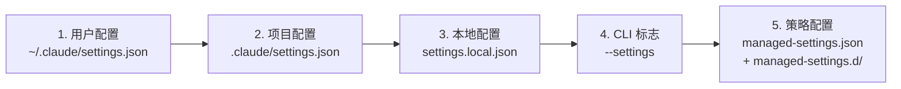

**Feature Flags（编译时）** — `build.ts:10`：

90+ 编译时 feature flags 通过 Bun 插件注入，实现死代码消除：
```typescript
const featureFlags = {
  VOICE_MODE: false,
  COORDINATOR_MODE: false,
  TOKEN_BUDGET: true,          // ★ 已启用
  MCP_SKILLS: true,            // ★ 已启用
  BUILTIN_EXPLORE_PLAN_AGENTS: true,
  COMPACTION_REMINDERS: true,
  // ... 86+ 其他 flags
}
```

访问方式：`feature('FLAG_NAME')` → 编译时替换为 `true/false` → 未命中的分支被彻底消除。

### 6. 数据流

**完整数据流转图（从用户输入到最终输出）：**

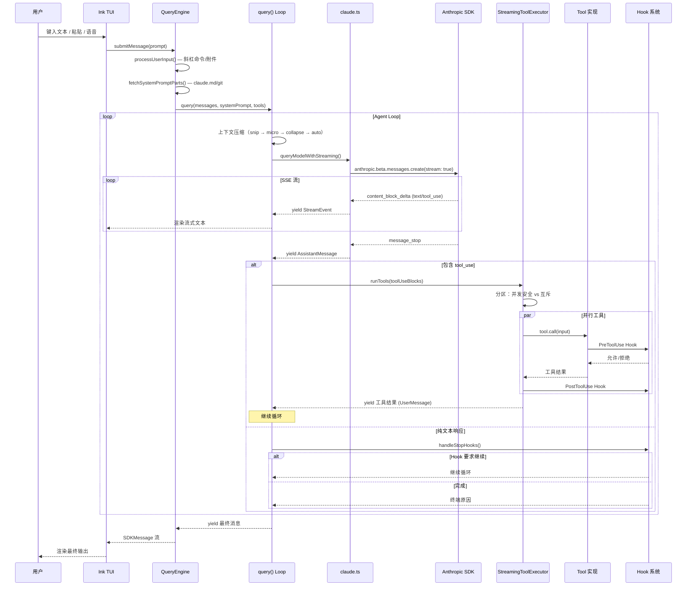

---

## 第三部分：关键设计深挖

### 7. 工具调用机制

#### 7.1 工具定义、注册与发现

**定义方式：** 每个工具是一个独立目录，包含实现文件和辅助模块：

```
src/tools/BashTool/
├── BashTool.tsx           # 主实现（1143 行）
├── bashPermissions.ts     # 权限检查
├── bashSecurity.ts        # 安全分析
├── commandSemantics.ts    # 命令语义识别
└── prompt.ts              # 系统提示词片段
```

**工厂函数** — `src/Tool.ts:783`：

```typescript
function buildTool(def: ToolDef): Tool {
  // 填充安全默认值
  const DEFAULTS = {
    isEnabled: () => true,
    isConcurrencySafe: () => false,    // ★ Fail-closed
    isReadOnly: () => false,           // ★ 默认假设写操作
    isDestructive: () => false,
    checkPermissions: () => ({ behavior: 'allow' }),
  }
  return { ...DEFAULTS, ...def }
}
```

**注册流程：**
1. `getAllBaseTools()` — 穷举所有内置工具 + 条件工具（feature flags）
2. `getTools()` — 过滤（deny 规则、REPL 专用、isEnabled）
3. `assembleToolPool()` — 合并内置 + MCP 工具，去重排序

#### 7.2 工具调用的序列化格式

与 Claude API 的 `tool_use` 协议完全对应：

```
API 请求 → tools[] 数组（JSON Schema 格式）
API 响应 → content_block: { type: "tool_use", id, name, input }
工具结果 → content_block: { type: "tool_result", tool_use_id, content }
```

**输入 Schema** 使用 Zod 定义 → 自动转换为 JSON Schema 提交给 API：
```typescript
tool.inputSchema  → Zod Schema  → 运行时校验
tool.inputJSONSchema → JSON Schema → 提交给 API（MCP 工具直接提供）
```

#### 7.3 工具执行的沙箱隔离

**BashTool 安全策略：**
- AST 解析检测危险命令（`rm`、`truncate`）
- 权限规则匹配（`Bash(git *)` 等）
- 超时控制
- 文件变更追踪 + VS Code 同步

**并发隔离** — `src/services/tools/StreamingToolExecutor.ts:40`：

```typescript
class StreamingToolExecutor {
  canExecuteTool(isConcurrencySafe: boolean): boolean {
    // 安全工具：可与其他安全工具并行
    // 不安全工具：独占执行（无其他工具运行）
    return executingTools.every(t => t.isConcurrencySafe)
  }
}
```

**Bash 错误级联：** 只有 Bash 工具的错误会级联到兄弟工具（命令可能有依赖关系），文件读取/Web 请求等只读工具的错误是隔离的。

#### 7.4 错误处理与重试

**API 层：** `src/services/api/withRetry.ts` — 指数退避重试

| 错误码 | 策略 | 最大重试 |
|--------|------|----------|
| 429 (Rate Limit) | 指数退避 | 10 次 |
| 529 (Overload) | 退避 + 流式回退 | 3 次连续 |
| 连接重置 | 重试 | 10 次 |
| 413 (Prompt Too Long) | 压缩后重试 | 1 次 |

**工具层：**
- 权限拒绝 → 渲染 `REJECT_MESSAGE` 给模型
- 文件错误 → `getErrnoCode()` 分类（ENOENT、EACCES 等）
- 验证错误 → `formatZodValidationError()` 格式化

### 8. 流式响应处理

#### 8.1 SSE 流式协议

**核心处理** — `src/services/api/claude.ts` 约 L1940：

```typescript
// 使用 Anthropic SDK 的 Stream<BetaRawMessageStreamEvent>
for await (const part of stream) {
  switch (part.type) {
    case 'message_start':     // 初始化消息和 usage
    case 'content_block_start': // 创建 text/tool_use/thinking 容器
    case 'content_block_delta': // 累积文本/JSON 增量
    case 'message_delta':     // 更新 token usage
    case 'message_stop':      // 最终化响应
  }
}
```

**超时保护：**
- 30 秒无事件 → 日志 `tengu_streaming_stall` 警告
- 120 秒无事件 → 中止流，日志 `tengu_streaming_idle_timeout`
- 非流式回退超时：300 秒（远程会话 120 秒）

#### 8.2 流式输出与工具调用的交织

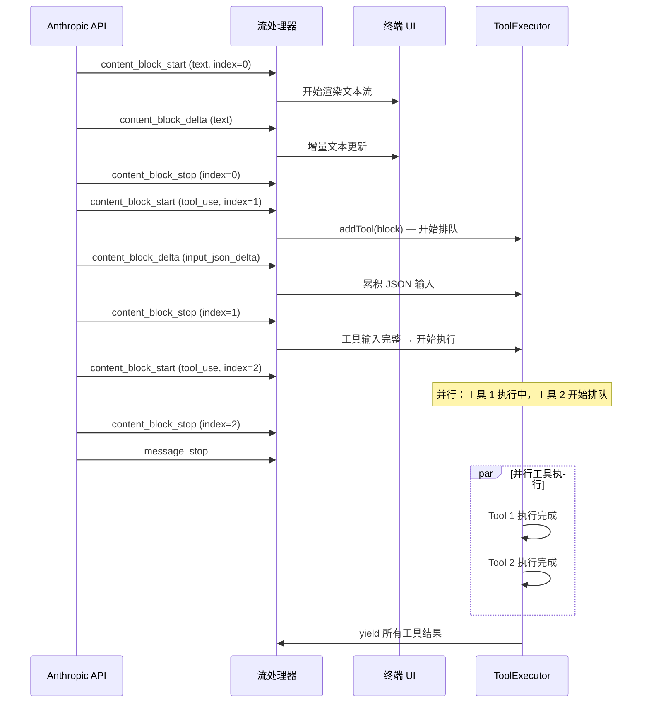

**关键特性：**
- 工具在流式传输期间就开始排队和执行（`StreamingToolExecutor`）
- 并行安全的工具同时执行，不安全的工具独占执行
- 进度消息绕过正常队列，立即推送到 UI

### 9. 会话与状态管理

#### 9.1 会话持久化方案

**本地存储结构：**
```
~/.claude/
├── settings.json              # 用户设置
├── CLAUDE.md                  # 用户级记忆
├── sessions/                  # 会话存储
│   └── {sessionId}/
│       ├── messages.json      # 对话消息
│       └── metadata.json      # 会话元数据
└── paste-store/               # 大型粘贴内容（hash-based）
```

**快照机制：**
- 压缩前快照消息（崩溃恢复）
- 压缩后重新快照（更新上下文）
- `--resume` 可从 pre-compact 状态恢复

#### 9.2 多轮对话的上下文拼接

```typescript
// 系统提示词构建 — src/utils/systemPrompt.ts
function buildEffectiveSystemPrompt(): string {
  // 优先级链：
  // 0. Override（如设置，替换所有其他）
  // 1. Coordinator prompt（协调器模式）
  // 2. Agent prompt（proactive 模式追加，normal 模式替换）
  // 3. Custom system prompt（--system-prompt）
  // 4. Default prompt（src/constants/prompts.ts）
  // 5. Append prompt（始终追加）
}
```

**上下文构成：**
```
[System Prompt]
  ├── 基础提示词
  ├── CLAUDE.md 文件内容
  ├── Git 状态上下文
  └── 当前日期
[Messages]
  ├── UserMessage（用户输入 + 附件）
  ├── AssistantMessage（AI 响应）
  ├── SystemMessage（压缩标记等元数据）
  └── ToolUseSummaryMessage（工具调用摘要）
```

#### 9.3 Token 超限时的截断/压缩策略

**Token 预算决策引擎** — `src/query/tokenBudget.ts`：

```typescript
function checkTokenBudget(tracker, agentId, budget, globalTurnTokens) {
  // 1. 子 Agent → 立即 STOP（有自己的预算）
  // 2. 无预算 → STOP
  // 3. Token < 预算 * 90% → CONTINUE（发送 nudge）
  // 4. Token > 预算 * 90% 或 递减回报 → STOP
  // 递减回报检测：delta < 500 tokens 连续 3+ 次
}
```

### 10. Hook 系统

#### 10.1 Hook 定义

**26 种 Hook 事件类型：**

| 类别 | 事件 |
|------|------|
| **工具生命周期** | `PreToolUse`, `PostToolUse`, `PostToolUseFailure` |
| **会话生命周期** | `SessionStart`, `SessionEnd`, `Setup` |
| **对话流程** | `UserPromptSubmit`, `Stop`, `StopFailure` |
| **压缩** | `PreCompact`, `PostCompact` |
| **权限** | `PermissionRequest`, `PermissionDenied` |
| **Agent** | `SubagentStart`, `SubagentStop`, `TeammateIdle` |
| **任务** | `TaskCreated`, `TaskCompleted` |
| **配置** | `ConfigChange`, `InstructionsLoaded` |
| **文件系统** | `CwdChanged`, `FileChanged` |
| **Worktree** | `WorktreeCreate`, `WorktreeRemove` |
| **其他** | `Notification`, `Elicitation`, `ElicitationResult` |

**5 种 Hook 命令类型：**

| 类型 | 说明 | 执行方式 |
|------|------|----------|
| `command` | Shell 命令 | bash/powershell，JSON 输入 |
| `prompt` | LLM 评估提示 | 模型推理 |
| `agent` | Agent 验证 | 结构化输出工具 |
| `http` | HTTP POST | JSON body 到 URL |
| `function` | JS 回调 | 内部使用 |

#### 10.2 Hook 触发与执行

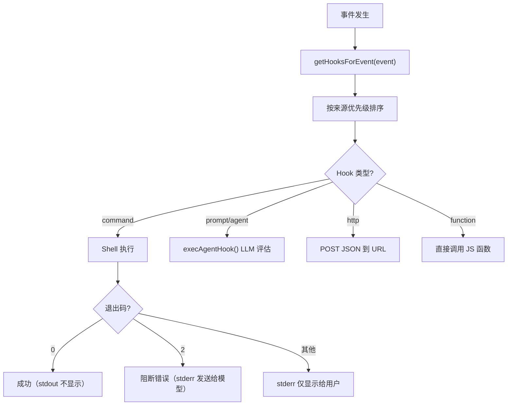

**Hook 来源优先级：**
`builtinHook` > `policySettings` > `pluginHook` > `sessionHook` > `user` > `project` > `local`

### 11. MCP（Model Context Protocol）集成

#### 11.1 MCP Server 连接与管理

**配置作用域（7 层）：**

| 层级 | 来源 | 说明 |
|------|------|------|
| 1 | `local` | `.mcp.json`（项目级） |
| 2 | `user` | `~/.claude/settings.json` |
| 3 | `project` | `.claude/settings.json` |
| 4 | `enterprise` | `managed-mcp.json`（只读） |
| 5 | `dynamic` | 运行时提供 |
| 6 | `claudeai` | Claude.ai 同步 |
| 7 | `managed` | 策略强制 |

**传输类型：** `stdio`（默认）、`sse`、`http`、`ws`、`sdk`、`sse-ide`、`ws-ide`

**连接状态机：**

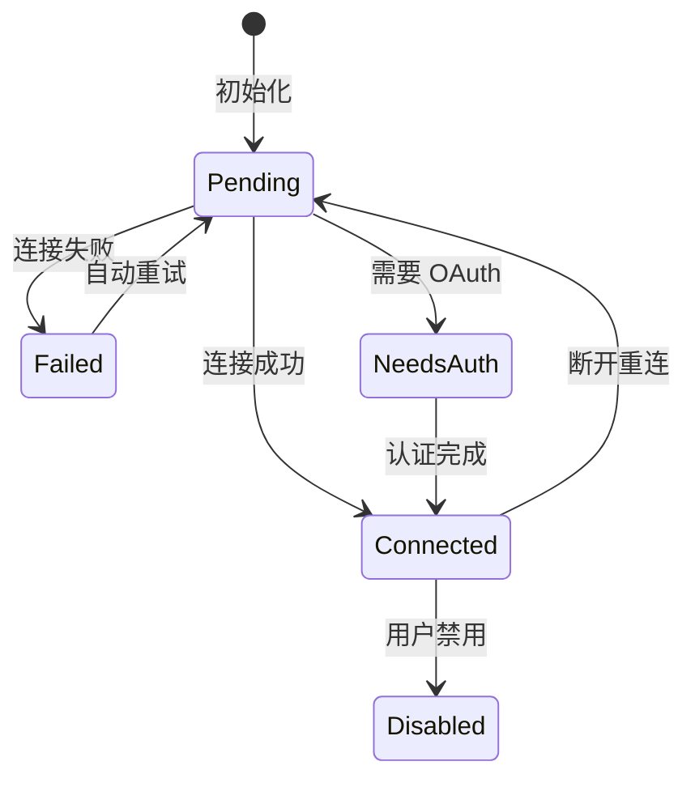

**自动重连：** 最多 5 次尝试，指数退避（1s → 30s）。

#### 11.2 MCP 工具注入

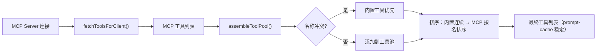

MCP 工具通过 `getMcpToolsCommandsAndResources()` 统一获取工具、资源和命令，缓存到 AppState，在重连或手动刷新时清除。

---

## 第四部分：代码质量与工程实践

### 12. 设计模式

| 设计模式 | 应用场景 | 文件 | 评价 |
|----------|----------|------|------|
| **工厂模式** | `buildTool()` 填充安全默认值 | `Tool.ts:783` | ★★★★★ Fail-closed 默认值设计优秀 |
| **注册表模式** | `getAllBaseTools()`、`COMMANDS()` | `tools.ts`, `commands.ts` | ★★★★☆ 穷举注册 + memoize |
| **异步生成器** | `query()`、`queryModel()`、工具执行 | `query.ts`, `claude.ts` | ★★★★★ 流式管道天然适配 |
| **状态机** | 工具执行状态、MCP 连接状态 | `StreamingToolExecutor.ts` | ★★★★☆ 显式状态转换 |
| **策略模式** | 压缩策略（snip/micro/collapse/auto） | `services/compact/` | ★★★★★ 可独立替换 |
| **观察者模式** | Hook 事件系统 | `utils/hooks/hookEvents.ts` | ★★★★☆ 最多 100 个待处理事件 |
| **装饰器模式** | `withRetry()` 包装 API 调用 | `services/api/withRetry.ts` | ★★★★★ 透明重试 |
| **备忘录模式** | 压缩前快照 + 恢复 | `query.ts` | ★★★★☆ 崩溃恢复 |
| **责任链** | 权限决策（Hook → 分类器 → 规则 → 用户） | `permissions.ts` | ★★★★★ 多层次灵活扩展 |
| **模块级单例** | `bootstrap/state.ts` 全局状态 | `bootstrap/state.ts` | ★★★☆☆ 简单但可测试性一般 |

### 13. 错误处理

**全局错误处理** — `src/utils/gracefulShutdown.ts`：

```typescript
// 未捕获异常 — 记录但不退出
process.on('uncaughtException', error => {
  logForDiagnosticsNoPII('error', 'uncaught_exception', {...})
  logEvent('tengu_uncaught_exception', { error_name })
  // 进程继续运行 — 允许优雅处理
})

// 未处理的 Promise 拒绝
process.on('unhandledRejection', reason => {
  logForDiagnosticsNoPII('error', 'unhandled_rejection', {...})
  logEvent('tengu_unhandled_rejection', { error_name })
})
```

**错误分类** — `src/services/api/errors.ts`（1207 行）：

| 错误类型 | 分类 | 处理策略 |
|----------|------|----------|
| 连接错误 | `isConnectionError` | 重试 |
| 速率限制 | `isRateLimitError` | 退避重试 |
| 过载 | 529 | 流式 → 非流式回退 |
| 提示过长 | 413 | 压缩 → 重试 |
| 认证失败 | `isAuthenticationError` | 终止 + 错误消息 |
| 配额超限 | `isOverageError` | 终止 + 提示 |

**边界情况覆盖：**
- 孤儿进程检测（每 30 秒）→ SIGTERM → SIGKILL（30 秒宽限）
- 流式空闲超时（30 秒警告，120 秒强制中止）
- 并行工具 Bash 错误级联 vs 只读工具隔离
- 413 错误的多级恢复（drain → compact → strip media）

### 14. 测试体系

> **注意：** 本仓库为从 NPM 包 source map 还原的源码，未包含原始测试框架。

**已知的测试相关设计：**
- `VCR 录制/回放`：API 调用被 `withVCR`/`withStreamingVCR` 包装，支持确定性测试
- `QueryDeps 注入`：`query()` 接受 `deps` 参数，可注入 mock 的 `callModel()`、`microcompact()` 等
- 请求 ID 链追踪：支持多次尝试的请求关联分析

**从代码设计推断的测试策略：**
- 异步生成器模式天然支持单元测试（可逐步 yield 验证）
- 工厂函数 + 依赖注入 → 易于 mock
- Feature flags → 可精确控制测试环境

### 15. 性能优化点

| 优化手段 | 位置 | 说明 |
|----------|------|------|
| **快速路由 Bootstrap** | `cli.tsx` | `--version` 等零导入退出 |
| **动态导入（Lazy Import）** | 全局 | 大部分模块按需加载 |
| **Memoized 初始化** | `init()` | 保证只执行一次 |
| **Prompt Cache 稳定排序** | `assembleToolPool()` | 工具排序不变 → API 缓存命中 |
| **Micro Compact 缓存** | `microcompactMessages()` | 增量压缩结果缓存 |
| **Token 估算** | `tokenCountWithEstimation()` | 避免每次精确计数的开销 |
| **并行工具执行** | `StreamingToolExecutor` | 安全工具并发，最大并发 10 |
| **流式工具排队** | 同上 | 流式传输期间提前排队工具 |
| **API 预连接** | `init.ts` | 启动时预建立 TCP 连接 |
| **VirtualMessageList** | `REPL.tsx` | 终端虚拟列表优化渲染 |
| **Feature Flag 死代码消除** | `build.ts` | 编译时移除未启用功能 |

---

## 第五部分：可借鉴的设计

### 16. 亮点总结

#### 亮点 1：多层次上下文压缩策略

**设计意图：** 在有限的 Token 窗口内最大化对话有效信息密度。

**工程价值：** 四层递进压缩（Snip → Micro → Collapse → Auto）+ 错误触发的 Reactive Compact，确保系统在任何 Token 预算下都能持续工作。每层压缩策略独立可替换（策略模式），新增压缩算法不影响现有逻辑。

#### 亮点 2：Fail-Closed 的工具安全默认值

**设计意图：** 新工具默认不并发安全、默认非只读，确保安全性。

**工程价值：** `buildTool()` 工厂函数的默认值设计体现了「默认安全」原则 — 开发者必须显式声明工具的并发安全性和只读性，而非默认信任。这在安全敏感的代码执行场景中至关重要。

#### 亮点 3：异步生成器驱动的流式管道

**设计意图：** 使用 `async function*` 实现从 API 到 UI 的端到端流式处理。

**工程价值：** 从 `queryModel()` 到 `query()` 再到 `QueryEngine`，整条管道使用异步生成器串联，实现了背压传播和懒求值。流式事件可以在产生时立即渲染，同时工具在流式传输期间就开始排队执行，最大化并行度。

#### 亮点 4：显式状态机的恢复路径

**设计意图：** 将所有异常恢复路径（413、529、max_output_tokens 等）建模为显式的 `state = {...}; continue;` 续接。

**工程价值：** 相比隐式递归或异常驱动的恢复，显式续接点：
- 可审计（每个恢复路径有唯一标识）
- 可遥测（每次恢复记录分析事件）
- 可调试（断点可设在具体续接行）
- 防止无限递归（恢复次数有显式上限）

#### 亮点 5：编译时 Feature Flag 系统

**设计意图：** 90+ feature flags 在编译时注入，未启用的代码分支彻底消除。

**工程价值：** 通过 Bun 插件在构建阶段替换 `feature('FLAG')` 调用为字面量 `true/false`，JavaScript 引擎的死代码消除可以彻底移除未启用的功能分支，减少包体积和运行时开销。相比运行时 feature flag 检查，零运行时成本。

### 17. 潜在改进

#### 改进 1：模块级全局状态 → 依赖注入

**现状：** `bootstrap/state.ts` 使用模块级变量管理全局状态（CWD、Session、Model 等），通过 getter/setter 函数访问。

**问题：** 模块级单例难以在测试中隔离，多个测试用例共享状态可能产生干扰。

**建议：** 引入轻量级 DI 容器或 Context 对象，将全局状态封装为可注入的依赖，提升可测试性。

#### 改进 2：压缩策略的统一抽象

**现状：** 四种压缩策略分散在 `services/compact/` 的不同文件中，在 `query.ts` 中按固定顺序调用。

**问题：** 新增压缩策略需要修改 `query.ts` 的调用链。

**建议：** 定义统一的 `CompactionStrategy` 接口，通过管道/责任链模式组合策略，在配置层决定策略组合和顺序。

#### 改进 3：TypeScript Strict 模式

**现状：** `tsconfig.json` 中 `strict: false`。

**问题：** 非 strict 模式可能遗漏类型安全问题（隐式 any、未检查的 null 等）。

**建议：** 逐步启用 strict 模式（先 `strictNullChecks`，再 `noImplicitAny`），配合 CI 检查防止回退。

### 18. 与同类产品对比

| 特性 | Claude Code | Cursor | GitHub Copilot CLI | Aider |
|------|------------|--------|-------------------|-------|
| **架构** | 独立 CLI + Agent Loop | IDE 内嵌 + 后端服务 | CLI wrapper | Python CLI + Git 集成 |
| **UI** | Ink React TUI | VS Code WebView | 简单终端输出 | 简单终端输出 |
| **工具系统** | 70+ 内置工具 + MCP | IDE 原生操作 | 有限 Shell 命令 | Git diff + Shell |
| **模型集成** | Anthropic API（专用） | 多模型（OpenAI/Anthropic） | GitHub Models | 多模型 |
| **上下文管理** | 4 层压缩 + 记忆文件 | 代码索引 + RAG | 最小上下文 | Git repo 上下文 |
| **权限模型** | 多层决策链 | IDE 权限 | 最小权限 | 自动提交 |
| **扩展性** | Hook + MCP + Plugin + Skill | VS Code 扩展 | 无 | 无 |
| **多 Agent** | Coordinator + Sub-agent | 无 | 无 | 无 |
| **远程执行** | CCR (Cloud Code Remote) | 远程 SSH | 无 | 无 |
| **企业管理** | 策略配置 + 托管设置 | 团队设置 | GitHub 组织 | 无 |

**Claude Code 的独特优势：**
1. **最完整的工具系统** — 70+ 内置工具 + MCP 协议扩展，远超其他 CLI 工具
2. **最复杂的上下文管理** — 四层压缩策略确保长对话有效性
3. **多 Agent 协调** — Coordinator 模式支持并行子任务
4. **企业级安全** — 多层权限决策 + Hook 扩展 + 策略管理

---

## 附录：关键代码引用索引

| 模块 | 文件 | 关键行号 | 说明 |
|------|------|----------|------|
| 入口 | `src/entrypoints/cli.tsx` | L33 | `main()` 函数 |
| 主逻辑 | `src/main.tsx` | L585 | `main()` 完整初始化 |
| 会话初始化 | `src/setup.ts` | L56 | `setup()` 函数 |
| 系统初始化 | `src/entrypoints/init.ts` | L57 | `init()` memoized |
| 工具类型 | `src/Tool.ts` | L362 | `Tool` 类型定义 |
| 工具工厂 | `src/Tool.ts` | L783 | `buildTool()` 函数 |
| 工具注册 | `src/tools.ts` | L193 | `getAllBaseTools()` |
| 工具过滤 | `src/tools.ts` | L271 | `getTools()` |
| 命令注册 | `src/commands.ts` | L258 | `COMMANDS()` |
| Agent Loop | `src/query.ts` | L219 | `query()` 生成器 |
| Loop 主循环 | `src/query.ts` | L241 | `queryLoop()` |
| API 流式调用 | `src/services/api/claude.ts` | L752 | `queryModelWithStreaming()` |
| 流事件循环 | `src/services/api/claude.ts` | ~L1940 | `for await` SSE 处理 |
| 工具执行器 | `src/services/tools/StreamingToolExecutor.ts` | L40 | 类定义 |
| 并发控制 | `src/services/tools/StreamingToolExecutor.ts` | L129 | `canExecuteTool()` |
| 工具编排 | `src/services/tools/toolOrchestration.ts` | L19 | `runTools()` |
| 权限决策 | `src/utils/permissions/permissions.ts` | L473 | `hasPermissionsToUseTool()` |
| 权限上下文 | `src/hooks/toolPermission/PermissionContext.ts` | L96 | `createPermissionContext()` |
| Feature Flags | `build.ts` | L10 | 编译时 flag 定义 |

---

## 学习建议

1. **入门路径：** 从 `src/entrypoints/cli.tsx` → `src/main.tsx` → `src/query.ts` 追踪主链路，理解端到端数据流。
2. **工具开发：** 参照 `src/tools/BashTool/` 的目录结构和 `buildTool()` 的默认值设计，理解工具的完整生命周期。
3. **压缩策略：** 深入 `src/services/compact/` 的四种策略实现，理解 Token 管理的核心挑战和解决方案。
4. **安全模型：** 追踪 `permissions.ts:473` 的决策链路，理解多层权限决策的设计哲学。
5. **流式处理：** 研究 `StreamingToolExecutor` 的并发调度逻辑和 `query()` 的异步生成器管道，这是现代 AI 应用的核心模式。

---

*分析基于 Claude Code v2.1.88 源码，通过 NPM 包 source map 还原。*
